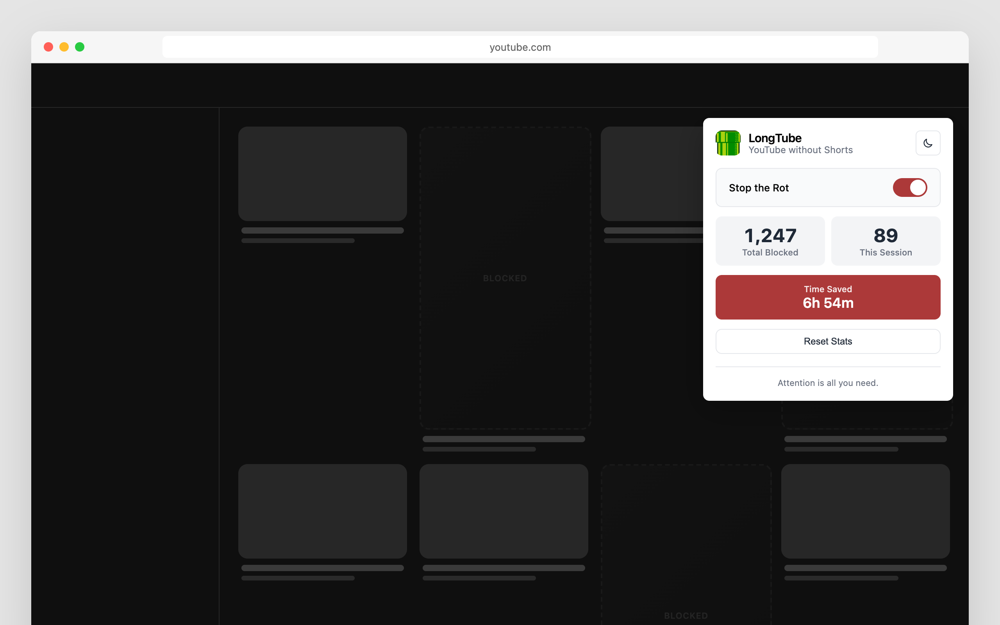

<div align="center">
  

# LongTube

YouTube without Shorts.


</div>

<div align="center">
  
[](https://chromewebstore.google.com/detail/longtube/monkacdphpcklckngjekpkbjkolemnjf)
[](https://addons.mozilla.org/en-US/firefox/addon/longtube)

</div>

<div align="center">
  
</div>

## Overview

LongTube is a browser extension that reduces short-form distractions on YouTube.
When enabled, it removes Shorts entry points in the interface and redirects direct Shorts URLs.

The goal is simple: keep YouTube focused on long-form viewing.

## What LongTube Does

- Injects blocking styles at page start on `youtube.com`.
- Removes common Shorts surfaces from the DOM, including shelves, links, navigation entries, and chips.
- Redirects Shorts pages when the blocker is enabled.
- Tracks total blocked items and session progress in extension storage.
- Provides a popup with enable/disable toggle, counters, and theme toggle.

## Installation

### Store Installs

- Chrome Web Store: [LongTube](https://chromewebstore.google.com/detail/longtube/monkacdphpcklckngjekpkbjkolemnjf)
- Firefox Add-ons: [LongTube](https://addons.mozilla.org/en-US/firefox/addon/longtube)

### Local Development Install

Install dependencies and build artifacts:

```bash
bun install
bun run build
```

Load in Chromium browsers:

1. Open `chrome://extensions`.
2. Enable Developer mode.
3. Click `Load unpacked`.
4. Select `/Users/nick/code/nickcorin/longtube/build/chrome`.

Load in Firefox:

1. Open `about:debugging#/runtime/this-firefox`.
2. Click `Load Temporary Add-on`.
3. Select `/Users/nick/code/nickcorin/longtube/build/firefox/manifest.json`.

Release bundles are produced in `/Users/nick/code/nickcorin/longtube/dist` as `chrome.zip` and `firefox.zip`.

## Usage

1. Open the extension popup.
2. Use the toggle to enable or disable blocking.
3. Use `Reset Stats` to clear counters.
4. If a YouTube tab is open, changes are applied immediately and the page refreshes to reset view state.

## Privacy

LongTube is intentionally minimal:

- Uses `storage` permission to persist extension settings and counters.
- Runs only on YouTube pages matched by `*://*.youtube.com/*`.
- Does not require account access and does not send analytics data from the extension code.

## Contributing

I built this for myself because I was tired of being force-fed short-form content without a real opt-out.
It worked well, so I shared it.

Feel free to use it, share it, or contribute.

If you want to contribute changes:

Open an issue or PR with a clear problem statement.
Keep behavior changes small and easy to review.
Run `bun run lint`, `bun run format:check`, and `bun run test` before submitting.

## License

MIT.
