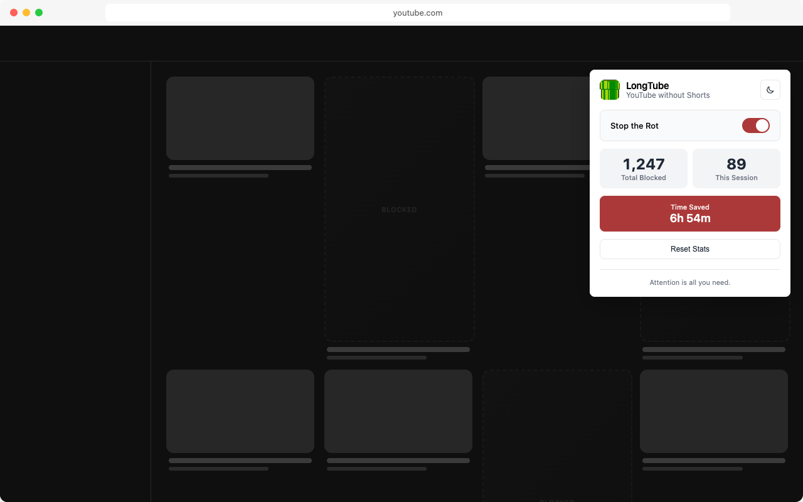

  

# LongTube

YouTube without Shorts.

  

  

## 🎯 What is LongTube?

LongTube is a browser extension that removes all short-form content from your YouTube UI.

Short-form content is engineered to be addictive. It hijacks your attention and leaves you doom-scrolling brain-rot
content.

LongTube is an opt-out for the times you want to focus on long-form content.

## 🚀 Features

- **🚫 Removes all Shorts** from YouTube's UI
- **↪️ Redirects** away from Shorts URLs
- **📊 Tracks** how many Shorts you've avoided
- **🔓 Open source** forever

## 📦 Installation

The extension has been submitted to the Chrome Web Store and the Firefox Add-Ons registry, but for now you can add
it locally.

### Download Release

Download the latest release from [GitHub Releases](https://github.com/nickcorin/longtube/releases).

**Chromium Browsers (Chrome/Edge/Brave):**

1. Navigate to your browser's extensions page:
   - Chrome: [chrome://extensions](chrome://extensions)
   - Edge: [edge://extensions](edge://extensions)
   - Brave: [brave://extensions](brave://extensions)
2. Enable "Developer mode"
3. Drag and drop the `chrome.zip` file into the window

**Gecko Browsers (Firefox/Zen):**

1. Navigate to [about:debugging#/runtime/this-firefox](about:debugging#/runtime/this-firefox)
2. Click "Load Temporary Add-on"
3. Select the `firefox.zip` file

> [!NOTE]
> Firefox temporary add-ons are removed when the browser closes. This is a Mozilla limitation for unsigned extensions.

## 🤝 Contributing

I vibe-coded this for myself because I was tired of being force fed short-form content without the ability to opt-out. It happens to work really well, so I thought I'd share it with others.

Feel free to use it, share it, or contribute.

## 📄 License

MIT.

---

**Focus on the content you want to see.**

